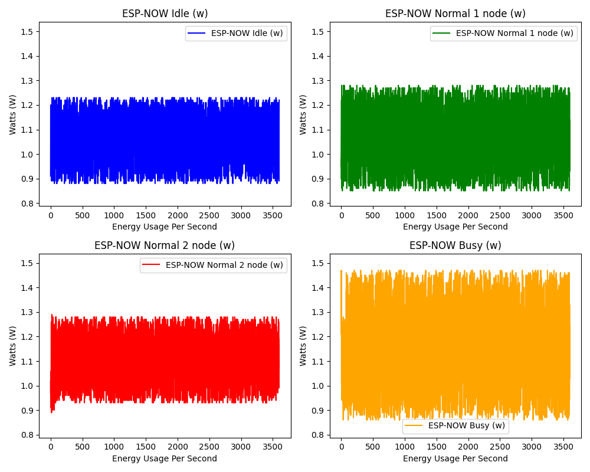
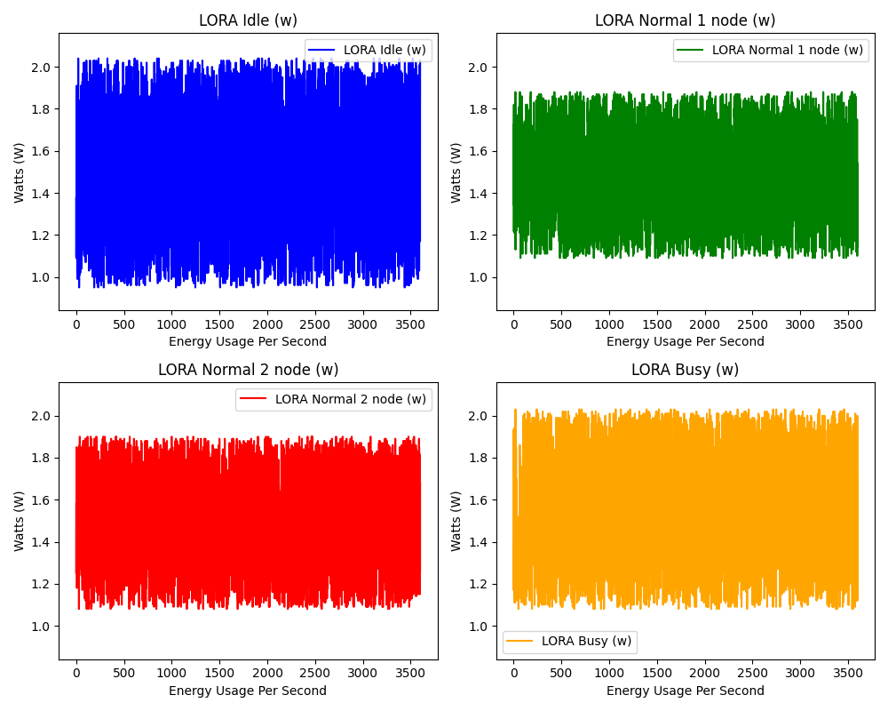
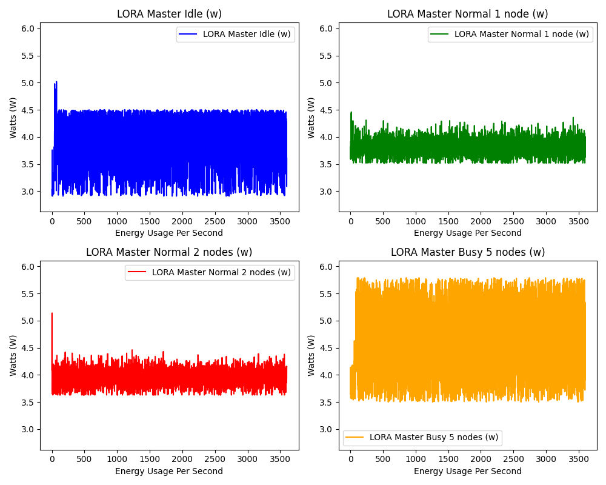

# Singapore Environmental Monitoring Project

## T24 Group Members
1. Benjamin Loh Choon How 2201590
2. Low Hong Sheng Jovian 2203654
3. Poon Xiang Yuan 2200559
4. Wang Ronqi Richie 2201942
5. Woon Jun Wei 2200624

## Introduction

Singapore, a frontrunner in sustainable urban development, grapples with a crucial data gap: the lack of a dedicated Wireless Sensor Network (WSN) to monitor harmful gas (CO2) emissions and their intricate link to temperature fluctuations across diverse urban environments. This absence of comprehensive data impedes our ability to accurately track progress towards ambitious environmental targets and formulate informed policies for critical issues like CO2 reduction and urban heat island mitigation.

## Problem Statement

The lack of comprehensive environmental monitoring poses a significant challenge within Singapore. Currently, there is a dearth of real-time data on CO2 levels and temperature, hindering informed decision-making and sustainable practices in the country. This data gap inhibits the establishment of correlations between environmental factors and their impact on campus well-being and sustainability. Consequently, there is a critical need to develop and deploy a scalable and energy-efficient mesh network utilizing efficient communication protocols to address this challenge.

## Objectives

By providing real-time environmental data, this project aims to enable:

- Identification of correlations between CO2 levels, temperature, and campus environmental conditions.
- Evaluation of the performance and suitability of LoRa and ESP-Now protocols in comparison to traditional mesh algorithms, addressing concerns regarding data latency, reliability, network scalability, and reach.
- Provision of actionable insights to policymakers and stakeholders, facilitating evidence-based strategies for enhancing environmental sustainability within NYP Campus and contributing to broader sustainability initiatives in Singapore.

Through the resolution of this pressing problem, the project endeavors to pave the way for data-driven decision-making and sustainable management practices within NYP Campus, aligning with Singapore’s commitment to environmental stewardship.

## Getting Started

### Prerequisites

- List of hardware and software requirements.
- Installation procedures for necessary tools and libraries.

### Installation

1. Steps to install the project.
2. Configuration guidelines.

## Usage

- How to deploy and run the network.
- Examples of monitoring and reporting.

## Dashboard Statistics

### ESP-NOW Node Power Consumption

### ESP-NOW Master Node Power Consumption

### LORA Node Power Consumption

### LORA Master Node Power Consumption
